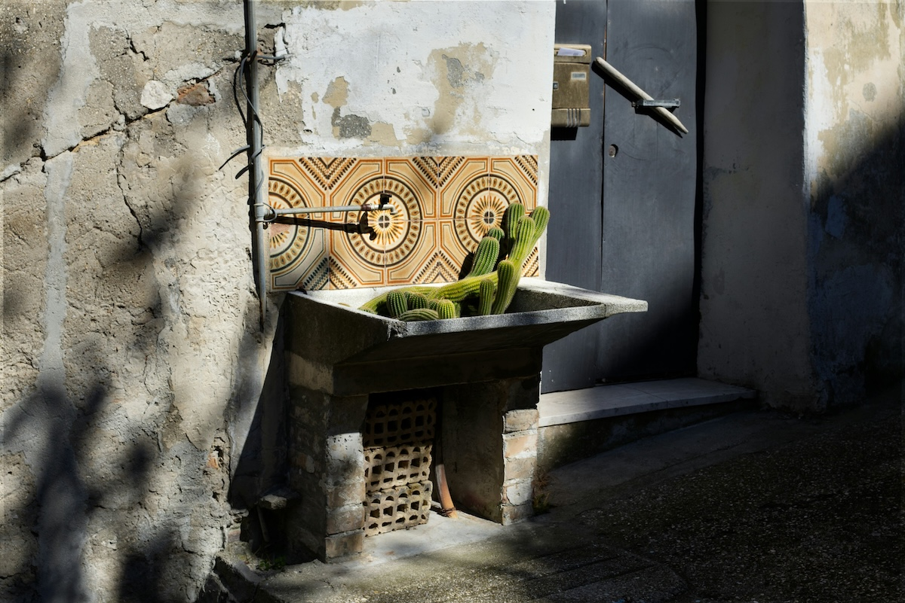

```{r setup, include=FALSE}
usethis::use_git_ignore(c("*.csv", "*.rds"))
options(htmltools.dir.version = FALSE)

library(knitr)
library(tidyverse)
library(xaringan)
library(fontawesome)
```

class: inverse, center, middle

# `r fa("fas fa-images", fill = "#fff")`

**View the slides:** 

[bretsw.com/eme6665-fs25-module7](https://bretsw.com/eme6665-fs25-module7)


---

class: inverse, center, middle

# `r fa("fas fa-map-location-dot", fill = "#fff")` <br><br> Finishing the Course

---

# `r fa("fas fa-map-location-dot", fill = "#fff")` Finishing the Course

```{r, out.width = "600px", echo = FALSE, fig.align = "center"}

```

### All revisions due Sunday, November 23

<hr>

### Final assingment due Friday, December 5


---

# `r fa("fas fa-keyboard", fill = "#fff")` Final Assignment

```{r, out.width = "300px", echo = FALSE, fig.align = "center"}
include_graphics("img/write.jpg")
```

**Objective:** Compile previously identified and evaluated research to compose a **complete** and **coherent** dissertation literature review.

Chapter One pulls together an Introduction, the Literature Review, a Conceptual Foundation, and Research Questions.

<hr>

- **Introduction**
  - Problem
  - Purpose
- **Literature Review**
- **Conceptual Foundation**
- **Purpose Research Questions**


---

# `r fa("fas fa-keyboard", fill = "#fff")` Final Assignment

```{r, out.width = "300px", echo = FALSE, fig.align = "center"}
include_graphics("img/write.jpg")
```

### Key elements:

- **Synthesis** of past research
- **Significance** of past research
- An argument
- Alignment and focus
- Narrative flow (topic sentences and transitions)


---

class: inverse, center, middle

# `r fa("fas fa-calendar-day", fill = "#fff")` <br><br> Semester Schedule

---

# `r fa("fas fa-calendar-day", fill = "#fff")` Semester Schedule

```{r, out.width = "480px", echo = FALSE, fig.align = "center"}
include_graphics("img/across-time.jpg")
```

- Module 1: Threads of Chapter One

- Module 2: Do You Trust Me?

- Module 3: Systematic Not Automatic

- Module 4: Synthesis Over Summary

- Module 5: Elements of Style (for Academic Writing)

- Module 6: Weaving Together Chapter One

- **Module 7: Beauty is in Revision**


---

# `r fa("fas fa-calendar-day", fill = "#fff")` Module 1: Threads

```{r, out.width = "100%", echo = FALSE, fig.align = "center"}
include_graphics("img/1-research-map.jpg")
```

---

# `r fa("fas fa-calendar-day", fill = "#fff")` Module 2: Trust

```{r, out.width = "100%", echo = FALSE, fig.align = "center"}

```

---

# `r fa("fas fa-calendar-day", fill = "#fff")` Module 3: Systematic

```{r, out.width = "100%", echo = FALSE, fig.align = "center"}
include_graphics("img/3-system.jpg")
```

---

# `r fa("fas fa-calendar-day", fill = "#fff")` Module 4: Synthesis

```{r, out.width = "100%", echo = FALSE, fig.align = "center"}
include_graphics("img/4-synthesis.jpg")
```

---

# `r fa("fas fa-calendar-day", fill = "#fff")` Module 5: Style

```{r, out.width = "100%", echo = FALSE, fig.align = "center"}
include_graphics("img/5-style.jpg")
```

---

# `r fa("fas fa-calendar-day", fill = "#fff")` Module 6: Weaving

```{r, out.width = "100%", echo = FALSE, fig.align = "center"}
include_graphics("img/6-weave.jpg")
```


---

class: inverse, center, middle

# `r fa("fas fa-square-pen", fill = "#fff")` <br><br> Module 7 <br> Beauty is in Revision

---

# `r fa("fas fa-square-pen", fill = "#fff")` Module 7: Revision

```{r, out.width = "100%", echo = FALSE, fig.align = "center"}

```

---

# `r fa("fas fa-square-pen", fill = "#fff")` Module 7: Revision

```{r, out.width = "540px", echo = FALSE, fig.align = "center"}

```

- A1: Research Map
- A2: Introduction Section
- A3: Research Outline
- A4: First Subsection
- A5: Second Subsection
- A6: First Full Draft


---

class: inverse, center, middle

# `r fa("fas fa-star", fill = "#fff")` <br><br> Writing Tips


---

# `r fa("fas fa-star", fill = "#fff")` Keep Calm

```{r, out.width = "100%", echo = FALSE, fig.align = "center"}
include_graphics("img/calm.jpg")
```


---

# `r fa("fas fa-star", fill = "#fff")` Get Organized

```{r, out.width = "100%", echo = FALSE, fig.align = "center"}
include_graphics("img/tidy.jpg")
```


---

# `r fa("fas fa-star", fill = "#fff")` Ask for Help

```{r, out.width = "100%", echo = FALSE, fig.align = "center"}

```


---

# `r fa("fas fa-star", fill = "#fff")` Be Clear and Consistent

```{r, out.width = "600px", echo = FALSE, fig.align = "center"}
include_graphics("img/write.jpg")
```

- Clearly define your concepts
- Clearly state the problem, your purpose, and the research questions
- Clearly describe your processes for reviewing the literature and selecting your methods
- Be consistent (use the same terms and phrases over and over)


---

# `r fa("fas fa-star", fill = "#fff")` Build on a Structure

```{r, out.width = "600px", echo = FALSE, fig.align = "center"}

```

- Follow the [FSU template for dissertations](https://gradschool.fsu.edu/current-students/thesis-treatise-and-dissertation/templates-formatting-assistance) (for formatting, not for content or sections)
- Use APA style (citations, formatting, voice, tense)


---

# `r fa("fas fa-star", fill = "#fff")` Start with an Outline

```{r, out.width = "600px", echo = FALSE, fig.align = "center"}
include_graphics("img/outline.jpg")
```

- Write an outline
- Turn bullet points into topic sentences
- Complete the paragraph with evidence from multiple sources


---
  
# `r fa("fas fa-star", fill = "#fff")` Write Topic Sentences
  
```{r, out.width = "100%", echo = FALSE, fig.align = "center"}
include_graphics("img/start.jpg")
```


---

# `r fa("fas fa-star", fill = "#fff")` Follow the Curves

```{r, out.width = "480px", echo = FALSE, fig.align = "center"}

```

- **Macro:** Follow your outline (and update your outline as necessary, then follow again)
- **Micro:** Follow your topic sentence (and revise your topic sentence as necessary, then follow again):
  - Topic sentence that names the common theme of the paragraph
  - Citations that offer specific supporting evidence of that theme


---

# `r fa("fas fa-star", fill = "#fff")` Section: Introduction

```{r, out.width = "600px", echo = FALSE, fig.align = "center"}
include_graphics("img/frame.jpg")
```

- Your **Introduction** section is about a problem (a challenge or an opportunity).
- This is where you tell your reader where you're headed.


---

# `r fa("fas fa-star", fill = "#fff")` Section: Foundations

```{r, out.width = "600px", echo = FALSE, fig.align = "center"}
include_graphics("img/streetlamp.jpg")
```

Your **Conceptual Foundations** section is like a **streetlamp**:

- It illuminates part of the path, but not everything.
- Your task is to pick the right streetlamp (foundation) that helps you guide your reader.


---

# `r fa("fas fa-share-nodes", fill = "#fff")` Section: Lit Review

```{r, out.width = "600px", echo = FALSE, fig.align = "center"}
include_graphics("img/bridge.jpg")
```

Your **Lit Review** section is a **bridge** 

- It connects the problem (Introduction) to your study (Research Questions + Method)


---

# `r fa("fas fa-star", fill = "#fff")` Craft an Argument

```{r, out.width = "600px", echo = FALSE, fig.align = "center"}
include_graphics("img/rain-window.jpg")
```

Your lit review should provide evidence to answer:

- Why is your study necessary?
- How should you go about your investigation?


---

# `r fa("fas fa-star", fill = "#fff")` Dig into What is Known

```{r, out.width = "600px", echo = FALSE, fig.align = "center"}
include_graphics("img/digging.jpg")
```

Your lit review is where you dig deep into what is already known (like mining)


---

# `r fa("fas fa-star", fill = "#fff")` Include Only What You Must

```{r, out.width = "600px", echo = FALSE, fig.align = "center"}
include_graphics("img/necessary-sufficient.jpg")
```

Your lit review should include only what *must* be there:

- "If-and-Only-If: Necessary and sufficient"
- What are the "load-bearing" walls in your lit review?


---
  
# `r fa("fas fa-star", fill = "#fff")` Filter Content
  
```{r, out.width = "480px", echo = FALSE, fig.align = "center"}
include_graphics("img/filter.jpg")
```

**Practical screening:** (Fink, 2020)
- Publication date: **year > 2020** (within the past 5 years)
- Source: Peer-reviewed journal articles, **impact factor > 1** (see FSU Libraries' [Academic Publishing Guide](https://guides.lib.fsu.edu/academicpublishing/citationanalysis)

**Methodological screening:** (Fink, 2020)


---

# `r fa("fas fa-star", fill = "#fff")` Note Signficance

```{r, out.width = "720px%", echo = FALSE, fig.align = "center"}

```

"In their <u>&nbsp;&nbsp;&nbsp;&nbsp;&nbsp;&nbsp;&nbsp;</u> study with <u>&nbsp;&nbsp;&nbsp;&nbsp;&nbsp;&nbsp;&nbsp;</u> group in <u>&nbsp;&nbsp;&nbsp;&nbsp;&nbsp;&nbsp;&nbsp;</u> context, AUTHOR (YEAR) found <u>&nbsp;&nbsp;&nbsp;&nbsp;&nbsp;&nbsp;&nbsp;</u>."


---

# `r fa("fas fa-star", fill = "#fff")` Look for Contrast

```{r, out.width = "720px%", echo = FALSE, fig.align = "center"}
include_graphics("img/contrast.jpg")
```

Contrast (and conflicting findings in the literature) is good!


---

class: inverse, center, middle

# `r fa("fas fa-map-location-dot", fill = "#fff")` <br><br> Finishing the Course

---

# `r fa("fas fa-map-location-dot", fill = "#fff")` Finishing the Course

```{r, out.width = "600px", echo = FALSE, fig.align = "center"}

```

### All revisions due Sunday, November 23

<hr>

### Final assingment due Friday, December 5


---

class: inverse, center, middle

# `r fa("fas fa-question", fill = "#fff")` <br><br> Questions

<hr>

**What questions can I answer for you now?**

**How can I support you this week?**

<hr>

`r fa("envelope", fill = "#fff")` [bret.staudtwillet@fsu.edu](mailto:bret.staudtwillet@fsu.edu) | `r fa("globe", fill = "#fff")` [bretsw.com](https://bretsw.com) | `r fa("fab fa-github", fill = "#fff")` [GitHub](https://github.com/bretsw/)
